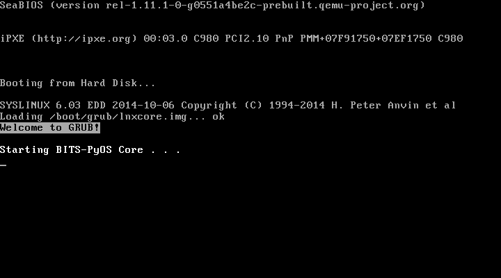

##  BITS-PyOS
BIOS-Implementation-Test-Suite-based Python Operating System

### IMPORTANT NOTE
This was created a while ago, when I had no clue what I was doing. Feel free to gawk at my poor practices, and jenky docs.

### Introduction

BITS-PyOS means:
- **B**IOS
- **I**mplementation
- **T**est
- **S**uite-based
- **Py**thon
- **O**perating
- **S**ystem

BITS is a custom version of GRUB2 that has an almost-bare-metal version of Python 2 integrated into it. This particular version of BITS uses SysLinux to boot. The "UI" is a custom script that I have designed in conjunction with external applications to create BITS-PyOS.

### Boot Process

BITS-PyOS boots in a bit of a vague way to me because I don't know the boot processes of SysLinux and GRUB2, but it kinda goes like this:
1. The ISOLINUX kernel is loaded.
2. ISOLINUX boots SysLinux.
3. SysLinux starts GRUB2.
4. GRUB2 imports all the Python libraries into RAM.
5. The boot menu is shown.
6. If the option to start is the BITS-PyOS UI, GRUB2 uses Python to execute the main script.
7. If the option to start is the Interactive Python Interpreter, GRUB2 simply starts that.

### Screenshots

  
  

### Other Documentation

- [ReadMe File](https://github.com/sykeben/BITS-PyOS/blob/master/readme.md)
- [USB Builder Instructions](https://github.com/sykeben/BITS-PyOS/blob/master/build2usb.md)
- [Windows Tools ReadMe](https://github.com/sykeben/BITS-PyOS/blob/master/wintools-beta/readme.md)

More documentation is coming soon...
